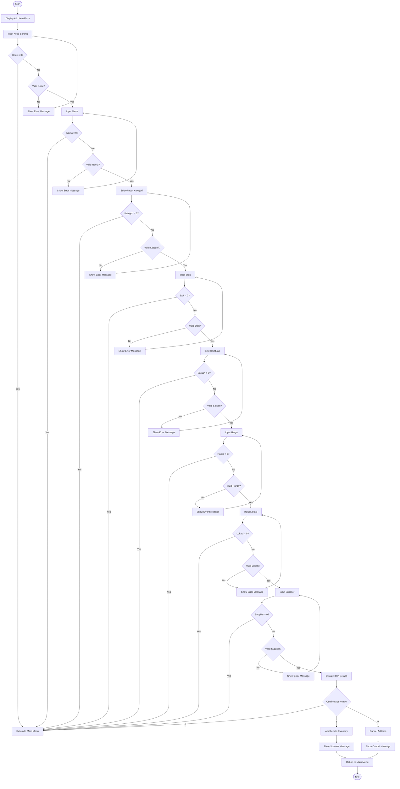

```mermaid
flowchart TD
    A([Start]) --> B[Display Add Item Form]
    
    B --> C[Input Kode Barang]
    C --> D{Kode = 0?}
    D -->|Yes| E[Return to Main Menu]
    D -->|No| F{Valid Kode?}
    
    F -->|No| G[Show Error Message]
    G --> C
    
    F -->|Yes| H[Input Nama]
    H --> I{Nama = 0?}
    I -->|Yes| E
    I -->|No| J{Valid Nama?}
    
    J -->|No| K[Show Error Message]
    K --> H
    J -->|Yes| L[Select/Input Kategori]
    
    L --> M{Kategori = 0?}
    M -->|Yes| E
    M -->|No| N{Valid Kategori?}
    
    N -->|No| O[Show Error Message]
    O --> L
    N -->|Yes| P[Input Stok]
    
    P --> Q{Stok = 0?}
    Q -->|Yes| E
    Q -->|No| R{Valid Stok?}
    
    R -->|No| S[Show Error Message]
    S --> P
    R -->|Yes| T[Select Satuan]
    
    T --> U{Satuan = 0?}
    U -->|Yes| E
    U -->|No| V{Valid Satuan?}
    
    V -->|No| W[Show Error Message]
    W --> T
    V -->|Yes| X[Input Harga]
    
    X --> Y{Harga = 0?}
    Y -->|Yes| E
    Y -->|No| Z{Valid Harga?}
    
    Z -->|No| AA[Show Error Message]
    AA --> X
    Z -->|Yes| AB[Input Lokasi]
    
    AB --> AC{Lokasi = 0?}
    AC -->|Yes| E
    AC -->|No| AD{Valid Lokasi?}
    
    AD -->|No| AE[Show Error Message]
    AE --> AB
    AD -->|Yes| AF[Input Supplier]
    
    AF --> AG{Supplier = 0?}
    AG -->|Yes| E
    AG -->|No| AH{Valid Supplier?}
    
    AH -->|No| AI[Show Error Message]
    AI --> AF
    AH -->|Yes| AJ[Display Item Details]
    
    AJ --> AK{Confirm Add? y/n/0}
    AK -->|0| E
    AK -->|y| AL[Add Item to Inventory]
    AK -->|n| AM[Cancel Addition]
    
    AL --> AN[Show Success Message]
    AM --> AO[Show Cancel Message]
    
    AN --> AP[Return to Main Menu]
    AO --> AP
    AP --> AQ([End])
``` 