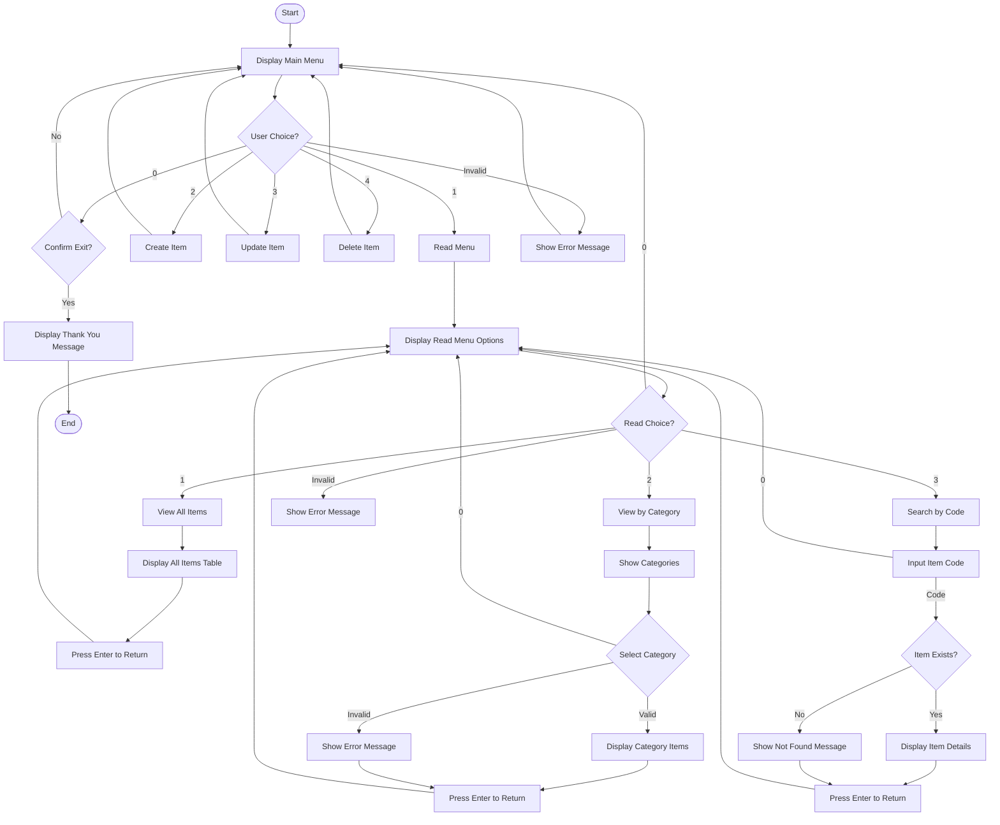

```mermaid
flowchart TD
    A([Start]) --> B[Display Main Menu]
    B --> C{User Choice?}
    
    C -->|1| D[Read Menu]
    C -->|2| E[Create Item]
    C -->|3| F[Update Item]
    C -->|4| G[Delete Item]
    C -->|0| H{Confirm Exit?}
    C -->|Invalid| I[Show Error Message]
    
    D --> J[Display Read Menu Options]
    J --> K{Read Choice?}
    
    K -->|1| L[View All Items]
    K -->|2| M[View by Category]
    K -->|3| N[Search by Code]
    K -->|0| B
    K -->|Invalid| O[Show Error Message]
    
    L --> P[Display All Items Table]
    P --> Q[Press Enter to Return]
    Q --> J
    
    M --> R[Show Categories]
    R --> S{Select Category}
    S -->|Valid| T[Display Category Items]
    S -->|0| J
    S -->|Invalid| U[Show Error Message]
    T --> V[Press Enter to Return]
    U --> V
    V --> J
    
    N --> W[Input Item Code]
    W -->|0| J
    W -->|Code| X{Item Exists?}
    X -->|Yes| Y[Display Item Details]
    X -->|No| Z[Show Not Found Message]
    Y --> AA[Press Enter to Return]
    Z --> AA
    AA --> J
    
    E --> B
    F --> B
    G --> B
    
    H -->|Yes| AB[Display Thank You Message]
    H -->|No| B
    
    I --> B
    
    AB --> AC([End])
``` 