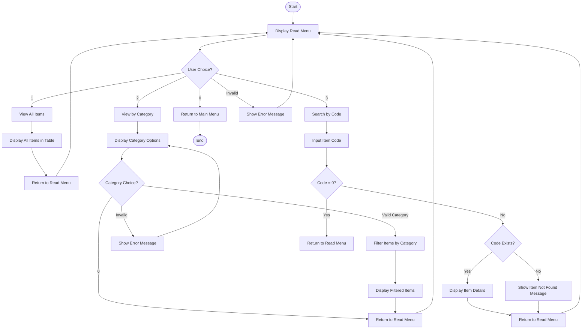

```mermaid
flowchart TD
    A([Start]) --> B[Display Read Menu]
    
    B --> C{User Choice?}
    C -->|1| D[View All Items]
    C -->|2| E[View by Category]
    C -->|3| F[Search by Code]
    C -->|0| G[Return to Main Menu]
    C -->|Invalid| H[Show Error Message]
    
    H --> B
    
    D --> I[Display All Items in Table]
    I --> J[Return to Read Menu]
    J --> B
    
    E --> K[Display Category Options]
    K --> L{Category Choice?}
    L -->|Valid Category| M[Filter Items by Category]
    L -->|0| N[Return to Read Menu]
    L -->|Invalid| O[Show Error Message]
    
    O --> K
    M --> P[Display Filtered Items]
    P --> N
    N --> B
    
    F --> Q[Input Item Code]
    Q --> R{Code = 0?}
    R -->|Yes| S[Return to Read Menu]
    R -->|No| T{Code Exists?}
    
    T -->|Yes| U[Display Item Details]
    T -->|No| V[Show Item Not Found Message]
    
    U --> W[Return to Read Menu]
    V --> W
    W --> B
    
    G --> X([End])
``` 