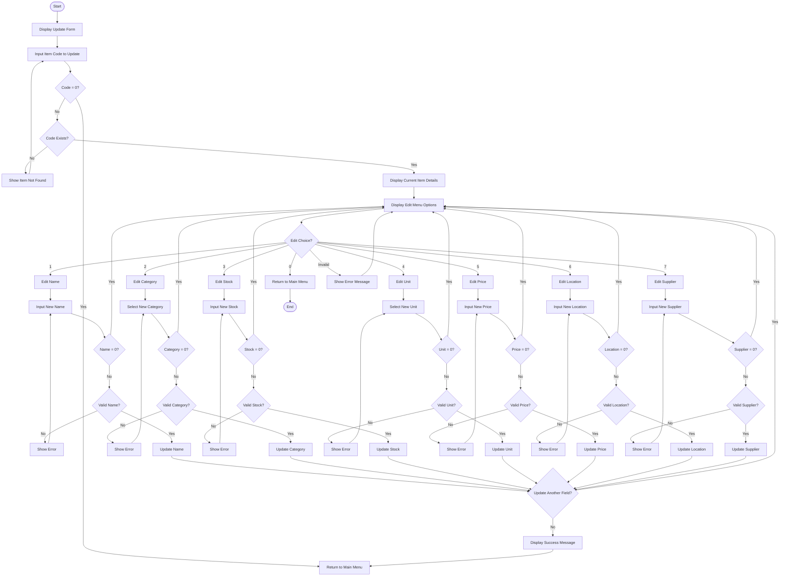

```mermaid
flowchart TD
    A([Start]) --> B[Display Update Form]
    
    B --> C[Input Item Code to Update]
    C --> D{Code = 0?}
    D -->|Yes| E[Return to Main Menu]
    D -->|No| F{Code Exists?}
    
    F -->|No| G[Show Item Not Found]
    G --> C
    
    F -->|Yes| H[Display Current Item Details]
    H --> I[Display Edit Menu Options]
    
    I --> J{Edit Choice?}
    J -->|1| K[Edit Name]
    J -->|2| L[Edit Category]
    J -->|3| M[Edit Stock]
    J -->|4| N[Edit Unit]
    J -->|5| O[Edit Price]
    J -->|6| P[Edit Location]
    J -->|7| Q[Edit Supplier]
    J -->|0| R[Return to Main Menu]
    J -->|Invalid| S[Show Error Message]
    
    S --> I
    
    K --> T[Input New Name]
    T --> U{Name = 0?}
    U -->|Yes| I
    U -->|No| V{Valid Name?}
    
    V -->|No| W[Show Error]
    W --> T
    V -->|Yes| X[Update Name]
    X --> Y{Update Another Field?}
    
    L --> L1[Select New Category]
    L1 --> L2{Category = 0?}
    L2 -->|Yes| I
    L2 -->|No| L3{Valid Category?}
    
    L3 -->|No| L4[Show Error]
    L4 --> L1
    L3 -->|Yes| L5[Update Category]
    L5 --> Y
    
    M --> M1[Input New Stock]
    M1 --> M2{Stock = 0?}
    M2 -->|Yes| I
    M2 -->|No| M3{Valid Stock?}
    
    M3 -->|No| M4[Show Error]
    M4 --> M1
    M3 -->|Yes| M5[Update Stock]
    M5 --> Y
    
    N --> N1[Select New Unit]
    N1 --> N2{Unit = 0?}
    N2 -->|Yes| I
    N2 -->|No| N3{Valid Unit?}
    
    N3 -->|No| N4[Show Error]
    N4 --> N1
    N3 -->|Yes| N5[Update Unit]
    N5 --> Y
    
    O --> O1[Input New Price]
    O1 --> O2{Price = 0?}
    O2 -->|Yes| I
    O2 -->|No| O3{Valid Price?}
    
    O3 -->|No| O4[Show Error]
    O4 --> O1
    O3 -->|Yes| O5[Update Price]
    O5 --> Y
    
    P --> P1[Input New Location]
    P1 --> P2{Location = 0?}
    P2 -->|Yes| I
    P2 -->|No| P3{Valid Location?}
    
    P3 -->|No| P4[Show Error]
    P4 --> P1
    P3 -->|Yes| P5[Update Location]
    P5 --> Y
    
    Q --> Q1[Input New Supplier]
    Q1 --> Q2{Supplier = 0?}
    Q2 -->|Yes| I
    Q2 -->|No| Q3{Valid Supplier?}
    
    Q3 -->|No| Q4[Show Error]
    Q4 --> Q1
    Q3 -->|Yes| Q5[Update Supplier]
    Q5 --> Y
    
    Y -->|Yes| I
    Y -->|No| Z[Display Success Message]
    Z --> E
    
    R --> AA([End])
``` 